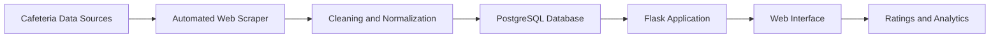

# MENSA APP – Data-Driven Cafeteria Platform

MENSA APP is a full-stack web application for collecting, processing, and presenting cafeteria menu data for students in Tübingen. The system combines automated data acquisition, structured persistence, analytical processing, and an interactive multilingual interface.

## 🎥 Demo

[▶ Watch the project demo](https://github.com/aaronsennhenn/data_science_project/releases/tag/mensa_app_demo)

## System Architecture

